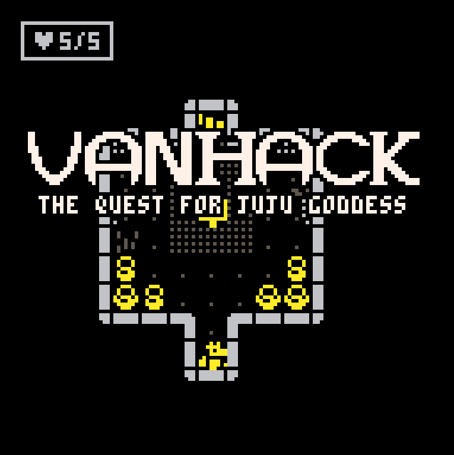
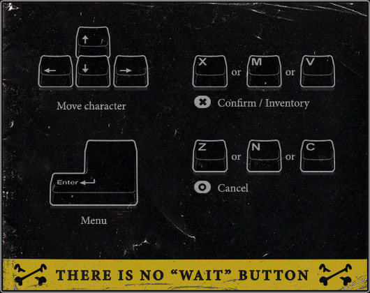
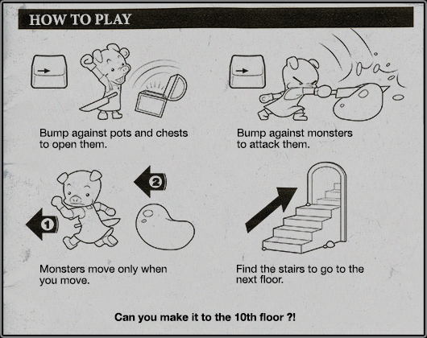

# **Vanhack Dungeons (Rogue-like game)**

During an unprecedented world cataclysm where all people started to turn into monsters. You find yourself inside the Vanhack company lobby where you were waiting for your girlfriend. But suddenly the company building became a dungeon and all its employees were converted into bizarre monsters.

Now your goal is to save the goddess juju! (your girlfriend)

Click on the image to play in your browser.

## **How to  play**

All dungeon levels are randomly generated (rogue-like). Each time you enter the game the labyrinth will be different.

You will be able to find items inside the barrels. All items are randomly chosen too, you will need a lot of luck to finish all 20 levels and save the goddess Juju.

All monsters move only when you move, if they see you, you will be chased. If you don't have the strength to defeat them, you can try to run away.

**TIP:** When approaching monsters try to hit them first on your turn.

## **Monters**

Workers name mixed with monster type.

* Camislime
* Fernamelt
* Jushoggoth
* Bitantisman
* Mariscorpion
* Alighost
* Dezagolem
* Ludrake

## **Items hidden in barrels**

Each of the items below you can add to your inventory.

### **Attack items**

These are the items you can use to increase your attack level.

* Butter knife
* Cheese knife
* Paring knife
* Utility knife
* Chef's knife
* Meat cleaver
* Spork
* Salad fork
* Fish fork
* Dinner fork

### **Protection items**

These are the items you can use to increase your protection level.

* Paper apron
* Cotton apron
* Rubber apron
* Leather apron
* Chef's apron
* Butcher's apron
* food
 
Remember that some items can heal, others can curse, and some can stunt you, be brave!